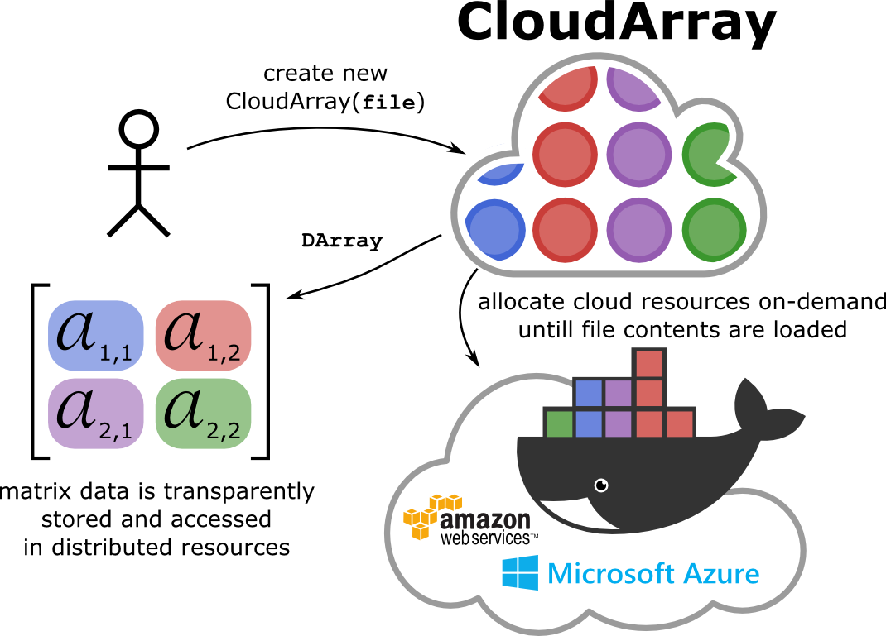
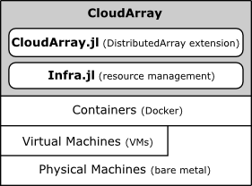

# Overview

**CloudArray** is a programming abstraction that eases big data programming in the cloud. CloudArray loads data from files then books and configures the right amount of resources (VMs, containers) able to process it. Data loading and resource management are entirely automatic and performed on-demand. 

CloudArray builds on top of [Julia](http://julialang.org) native [DistributedArrays](https://github.com/JuliaParallel/DistributedArrays.jl) abstraction, a multi-dimensional array whose data is transparently stored at distributed computers. Indeed, _a CloudArray is a DistributedArray whose data and resource managements are automatic_ as the figure bellow illustrates: data load, VM booking, Julia workers configuration on top of Docker containers. 



Therefore, existent codes that use DistributedArrays don't need to be adapted in order to use CloudArray. You just need to include CloudArray and use your cloud account, no need to manually interact with your cloud provider.

You are very welcome to [**<span style="color:red">try CloudArray from CloudArrayBox</span>**](http:/cloudarraybox.cloudapp.net/), a Web front end hosted at Azure.


# Architecture

CloudArray design is composed by two layers (c.f. Figure Architecture):

* **CloudArray.jl** is an extension of [DistributedArrays.jl](https://github.com/JuliaParallel/DistributedArrays.jl) which automatically loads data from files (or other I/O stream) and store it at distributed Workers as DArray.
* **Infra.jl** books virtual machines (VMs) and creates, configures, and instantiates Docker containers on top of VMs. Then Julia Workers are configured and deployed on containers. 
	



# Usage

## Main constructors

CloudArray main constructors are very simple and can be created by using an `Array` or a file.

### Creating a CloudArray from an `Array`

You just need to tell `DArray` constructor which `Array` should be used to constructu your CloudArray:

```
DArray(Array(...))
```

#### Example 

In this example, we first create the array `arr` with 100 random numbers then we create a CloudArray with the `arr` data:

```Julia
arr = rand(100)
cloudarray_from_array = DArray(arr) # will take less than one minute
```


### Creating a CloudArray from a file

If you are dealing with big data, i.e., your RAM memory is not enough to store your data, you can create a CloudArray from a file.

```Julia
DArray(file_path)
```

```file_path``` is the path to a text file in your local or distributed file system. All lines will be used to fill `DArray` elements sequentially. This constructor ignores empty lines.


#### Example 

Let's first create a simple text file with 100 random numbers. 

```Julia
f = open("data.txt","w+")
for i=1:100
    if i==100
        write(f,"$(rand())")
    else
        write(f,"$(rand())\n")
    end    
end
close(f)
```

Then we create a CloudArray with `data.txt` file.

```Julia
cloudarray_from_file = DArray("data.txt")
```

You don't really need to know it, but if you are curious on how your data is stored, you can get further information such as:

```Julia
@show cloudarray_from_array.chunks
@show cloudarray_from_array.cuts
@show cloudarray_from_array.dims
@show cloudarray_from_array.indexes
@show cloudarray_from_array.pids
```

Please read [DistributedArrays documentation](https://github.com/JuliaParallel/DistributedArrays.jl) to better understand these low-level details if you want.

## Core constructor

If you want to tune your CloudArray, you can directly use the CloudArray core constructor:

```julia
carray_from_task(generator::Task=task_from_text("test.txt"), is_numeric::Bool=true, chunk_max_size::Int=1024*1024,debug::Bool=false)
```
Arguments are:

* ```task_from_text``` same as ```file_path```.
* ```is_numeric``` set to ```false``` if you need to load String instead of Float.
* ```chunk_max_size``` sets the maximum size that is allowed for each DArray chunk.
* ```debug``` enables debug mode.

## Example

As follows, we create a CloudArray by using the `data.txt` file which holds numeric values (then second argument is `true`) and we 

```Julia
custom_cloudarray_from_file = DArray("data.txt", true, 1000)
```

# Installation

You may [**try CloudArray from CloudArrayBox**](http:/cloudarraybox.cloudapp.net/), without installing any software at all. Just login with your Google account and run some examples.

If you need to use CloudArray from your computer with your own cloud provider, you can easily install and use CloudArray as explained next.

* Install [Julia 0.4](http://julialang.org/downloads/)
* From your Julia console, run:

```Julia
Pkg.clone("https://github.com/gsd-ufal/CloudArray.jl.git")
using CloudArray
```

## Future Features

* Support other cloud infrastructures
	* Amazon EC2
	* OpenStack
* Set a price threshold
* Provide different QoS
	* E.g., Pricy and fastest vs. Cheapest and not so fast
* Add the following containers monitoring functions:
	* ```cpu_usage(key::Integer)```
	* ```io_usage(key::Integer)```
* Let users define which CSV separator should be used
* RESTful API
* CloudDataFrame: extend CloudArray to support DataFrame
* Use Azure REST API
* Redundancy: if Julia fails, it removes containers (mask this fault)
* Create tests

## BUGFIX

* Explicitly release resources (containers and VMs) after usage
* Use Julia Module to be able to call ```cloud_setup.sh```
* CloudArrayBox logo transparent
* Replace `sshpass` by another means to authenticate through SSH
	* maybe require users' public key?

# Acknowledgements

CloudArray is developed by the [Research Group in Distributed Systems](https://sites.google.com/a/ic.ufal.br/andrelage/home/research-overview/research-team-in-distributed-systems-gsd) at the Federal University of Alagoas (Brazil). CloudArray is partially founded by [Microsoft Azure Research Award](http://research.microsoft.com/en-us/projects/azure/).

